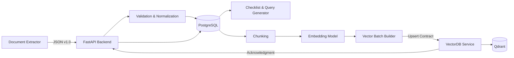
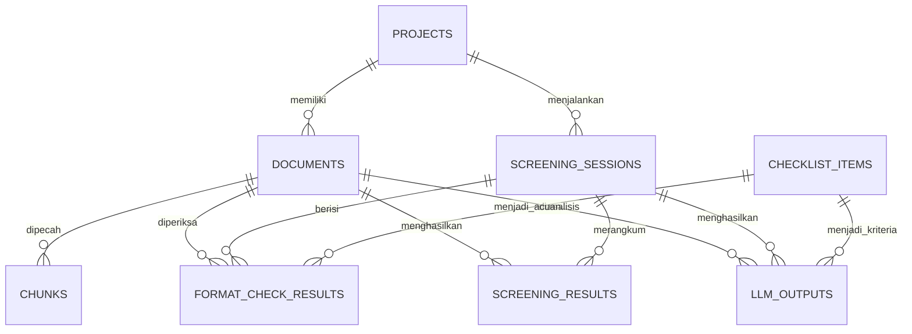

# AITF Backend Team 2

Backend pengolahan dokumen pengadaan dari **JSON hasil Document Extractor** sampai data siap digunakan oleh **VectorDB/Qdrant**. Repository juga memuat prototype alur screening format dan substansi.

> **Status:** implementasi prototype tersedia dan pemeriksaan sintaks Python lulus. Runtime end-to-end PostgreSQL–Qdrant–embedding–LLM belum diverifikasi. Endpoint pada bagian **Target Integration Contract** adalah spesifikasi antartim; belum semuanya tersedia dalam kode saat ini.

> **Desain berikutnya sudah disepakati:** JSON ingestion canonical, document versioning, RAB relational, worker berbasis PostgreSQL, embedding `multilingual-e5-base`, dan integrasi melalui API tim VectorDB. Kode prototype belum direvisi. Baca [Ingestion Foundation Design](docs/superpowers/specs/2026-10-02-ingestion-foundation-design.md) dan [Backend Flow](BACKEND_FLOW.md).

## Daftar Isi

1. [Scope Tim](#scope-tim)
2. [Arsitektur](#arsitektur)
3. [Flow Data Lengkap](#flow-data-lengkap)
4. [Isi Setiap Tahap](#isi-setiap-tahap)
5. [PostgreSQL dan ERD](#postgresql-dan-erd)
6. [VectorDB Contract](#vectordb-contract)
7. [API yang Sudah Diimplementasikan](#api-yang-sudah-diimplementasikan)
8. [Target Integration Contract](#target-integration-contract)
9. [Setup](#setup)
10. [Testing Manual](#testing-manual)
11. [Dokumentasi Tambahan](#dokumentasi-tambahan)

---

## Scope Tim

```text
                    TIM DOCUMENT EXTRACTOR
┌───────────────────────────────────────────────────┐
│ File PDF/DOCX/XLSX/OCR                            │
│                    │                              │
│                    ▼                              │
│ JSON berisi metadata, teks per halaman, dan tabel │
└──────────────────────────┬────────────────────────┘
                           │
                           │ JSON Contract v1.0
                           ▼
╔═══════════════════════════════════════════════════╗
║                SCOPE BACKEND TEAM 2               ║
╠═══════════════════════════════════════════════════╣
║ • Validasi schema dan ID                          ║
║ • Idempotensi dan deteksi revisi                  ║
║ • Normalisasi teks                                ║
║ • Penyimpanan PostgreSQL                          ║
║ • Checklist dan query generation                  ║
║ • Routing dokumen terstruktur/naratif             ║
║ • Chunking paragraf atau pasal                    ║
║ • Embedding 768 dimensi                           ║
║ • Pembuatan point dan vector batch                ║
║ • Pengiriman batch dan pencatatan acknowledgment  ║
╚══════════════════════════╤════════════════════════╝
                           │
                           │ {id, vector, payload}
                           ▼
                    TIM VECTOR DATABASE
┌───────────────────────────────────────────────────┐
│ Validasi batch → upsert Qdrant → search/delete    │
└───────────────────────────────────────────────────┘
```

### Input dan output

| Batas | Data |
|---|---|
| Input | JSON hasil ekstraksi per dokumen |
| Output | Batch point berisi `id`, `vector`, dan `payload` |
| Source of truth | PostgreSQL |
| Vector storage | Qdrant |

### Di luar scope utama

- Implementasi OCR dan ekstraksi PDF/DOCX.
- Internal Qdrant milik tim VectorDB.
- Top-K retrieval dan prompt LLM.
- Keputusan akhir ROCAN.

---

## Arsitektur



### Keputusan teknis

| Bagian | Keputusan |
|---|---|
| Framework | FastAPI |
| Database | PostgreSQL 16 |
| ORM | SQLAlchemy 2 async |
| Migration | Alembic |
| VectorDB | Qdrant 1.12 |
| Embedding | `paraphrase-multilingual-mpnet-base-v2` |
| Dimensi | 768 |
| Distance | Cosine |
| TOR | Chunk per paragraf/bagian |
| ACUAN/KEPMEN | Chunk per pasal |
| RAB/SBM | PostgreSQL + rule engine |

---

## Flow Data Lengkap

```text
┌─────────────────────────────┐
│ 1. JSON dari Extractor      │
│ metadata + pages + tables   │
└──────────────┬──────────────┘
               ▼
┌─────────────────────────────┐
│ 2. Validasi Contract        │
│ UUID, type, pages, checksum │
└──────────────┬──────────────┘
               ▼
┌─────────────────────────────┐
│ 3. Idempotency Check        │
│ request_id + checksum       │
└──────────────┬──────────────┘
               ▼
┌─────────────────────────────┐
│ 4. Normalisasi              │
│ UTF-8, line break, spacing  │
└──────────────┬──────────────┘
               ▼
┌─────────────────────────────┐
│ 5. Simpan PostgreSQL        │
│ document + content + status │
└──────────────┬──────────────┘
               ▼
       ┌───────────────┐
       │ 6. Routing    │
       │ document_type │
       └───────┬───────┘
               │
      ┌────────┴─────────────┐
      ▼                      ▼
┌────────────────┐  ┌────────────────────┐
│ RAB / SBM      │  │ TOR/ACUAN/KEPMEN   │
│ SQL + rules    │  │ Narrative pipeline │
└────────────────┘  └──────────┬─────────┘
                               ▼
                    ┌────────────────────┐
                    │ 7. Checklist/Query │
                    └──────────┬─────────┘
                               ▼
                    ┌────────────────────┐
                    │ 8. Chunking        │
                    │ paragraf / pasal   │
                    └──────────┬─────────┘
                               ▼
                    ┌────────────────────┐
                    │ 9. Simpan Chunk    │
                    │ ke PostgreSQL      │
                    └──────────┬─────────┘
                               ▼
                    ┌────────────────────┐
                    │ 10. Embedding      │
                    │ float[768]         │
                    └──────────┬─────────┘
                               ▼
                    ┌────────────────────┐
                    │ 11. Point Builder  │
                    │ id+vector+payload  │
                    └──────────┬─────────┘
                               ▼
                    ┌────────────────────┐
                    │ 12. Vector Batch   │
                    └──────────┬─────────┘
                               ▼
                    ┌────────────────────┐
                    │ 13. VectorDB API   │
                    │ Upsert ke Qdrant   │
                    └──────────┬─────────┘
                               ▼
                    ┌────────────────────┐
                    │ 14. ACK & Update   │
                    │ status PostgreSQL  │
                    └────────────────────┘
```

---

## Isi Setiap Tahap

### 1–4. Input, validasi, idempotensi, normalisasi

Backend memastikan:

- `schema_version` sesuai contract.
- Semua ID berbentuk UUID.
- `document_type` adalah `TOR`, `RAB`, `SBM`, `ACUAN`, atau `KEPMEN`.
- Nomor halaman valid dan tidak duplikat.
- `request_id` yang sama tidak menghasilkan data ganda.
- Teks bersih tanpa mengubah angka, nominal, atau nomor pasal.

### 5. Penyimpanan PostgreSQL

PostgreSQL menyimpan metadata, teks sumber, checklist, query, chunk, dan status proses. Data ini dapat dipakai untuk membangun ulang VectorDB.

### 6. Routing dokumen

```text
RAB/SBM      → data terstruktur → SQL/rule engine
TOR          → chunk paragraf   → tor_chunks
ACUAN/KEPMEN → chunk pasal      → reference_chunks
```

### 7. Checklist dan query generator

Checklist aktif dibaca dari PostgreSQL. Deskripsi checklist diubah menjadi `query_text`, filter project/dokumen, dan nilai `top_k`.

### 8–9. Chunking dan penyimpanan chunk

Setiap chunk memiliki:

```text
chunk_id
document_id
chunk_index
chunk_type
content
page_number
pasal_number
metadata
```

Chunk disimpan sebelum embedding agar proses dapat diulang jika model atau VectorDB gagal.

### 10. Embedding

`chunk.content` diubah menjadi vector `float[768]`. Satu collection tidak boleh mencampurkan model atau dimensi embedding berbeda.

### 11–12. Point dan vector batch

```json
{
  "id": "f06bed98-003a-4a15-a033-094be9230366",
  "vector": [0.014, -0.028, 0.091],
  "payload": {
    "schema_version": "1.0",
    "project_id": "fb3cf880-e53d-4fe6-a66c-e572b5b85db0",
    "document_id": "2d80aaac-86db-45e5-b894-8a46ccb45596",
    "document_type": "TOR",
    "chunk_id": "769a14d8-5ec6-4fd6-810b-801012d9270a",
    "chunk_index": 0,
    "chunk_type": "PARAGRAF",
    "content": "Ruang lingkup kegiatan meliputi...",
    "page_number": 2,
    "pasal_number": null,
    "is_active": true
  }
}
```

Vector dipersingkat; data aktual memiliki tepat 768 nilai.

### 13–14. VectorDB dan acknowledgment

Tim VectorDB memvalidasi batch, melakukan upsert, lalu mengembalikan `INDEXED`, `PARTIALLY_INDEXED`, atau `FAILED`. Backend mencatat hasil tersebut di PostgreSQL.

---

## PostgreSQL dan ERD

### ERD implementasi prototype saat ini



| Tabel saat ini | Fungsi |
|---|---|
| `projects` | Project dan klien |
| `documents` | File, teks hasil ekstraksi, status |
| `chunks` | Potongan dokumen dan referensi Qdrant |
| `checklist_items` | Kriteria format/substansi |
| `screening_sessions` | Sesi Screening 1/2 |
| `format_check_results` | Hasil rule engine per checklist |
| `screening_results` | Ringkasan per tahap |
| `llm_outputs` | Klasifikasi, alasan, bukti, rekomendasi |

### Tabel target integrasi antartim

Contract target menambahkan:

```text
document_contents
ingestion_jobs
generated_queries
embedding_records
vector_batches
vector_batch_items
```

Detail lengkap: [`TEAM_INTEGRATION_CONTRACT.md`](TEAM_INTEGRATION_CONTRACT.md).

---

## VectorDB Contract

### Collection

| Collection | Isi | Aturan |
|---|---|---|
| `tor_chunks` | Chunk TOR | Search wajib filter `project_id` |
| `reference_chunks` | ACUAN dan KEPMEN | Menyimpan pasal dan edisi |

```yaml
vector_size: 768
distance: COSINE
```

### Field payload wajib

```text
schema_version
project_id
document_id
document_type
chunk_id
chunk_index
chunk_type
content
page_number
pasal_number
is_active
```

`is_active: true` berarti chunk boleh dipakai saat pencarian. Versi lama diberi `false` agar tetap tersedia untuk audit tetapi tidak muncul dalam hasil normal.

### Endpoint milik VectorDB

| Method | Endpoint | Fungsi |
|---|---|---|
| `POST` | `/api/v1/vectors/upsert` | Menyimpan batch point |
| `POST` | `/api/v1/vectors/search` | Semantic search dengan filter |
| `DELETE` | `/api/v1/vectors/documents/{id}` | Menghapus seluruh point dokumen |
| `PATCH` | `/api/v1/vectors/documents/{id}/deactivate` | Menonaktifkan versi lama |
| `GET` | `/health` | Memeriksa Qdrant dan collection |

---

## API yang Sudah Diimplementasikan

Base URL lokal: `http://localhost:8000`

Swagger: `http://localhost:8000/docs`

### Health

```http
GET /health
```

### Projects

```http
POST   /api/v1/projects
GET    /api/v1/projects
GET    /api/v1/projects/{project_id}
PATCH  /api/v1/projects/{project_id}
DELETE /api/v1/projects/{project_id}
GET    /api/v1/projects/{project_id}/results
```

### Documents

```http
POST   /api/v1/documents/upload
GET    /api/v1/documents/{document_id}
DELETE /api/v1/documents/{document_id}
```

Upload menggunakan `multipart/form-data` dengan field:

```text
project_id
doc_type
file
```

File: PDF, DOCX, TXT. Ukuran maksimum default: 25 MB.

### Screening

```http
POST /api/v1/screening/1/start
GET  /api/v1/screening/1/{session_id}
POST /api/v1/screening/2/start
GET  /api/v1/screening/2/{session_id}
POST /api/v1/screening/{session_id}/approve
POST /api/v1/screening/{session_id}/reject
```

Screening 2 hanya dapat dimulai ketika Screening 1 terbaru menghasilkan `LOLOS`.

---

## Target Integration Contract

Endpoint berikut adalah contract target antartim dan **belum seluruhnya diimplementasikan**:

| Pemilik | Method | Endpoint | Fungsi |
|---|---|---|---|
| Backend | `POST` | `/api/v1/ingestions` | Menerima JSON extractor |
| Backend | `GET` | `/api/v1/ingestions/{id}` | Status ingestion |
| Backend | `GET` | `/api/v1/checklists` | Mengambil checklist aktif |
| Backend | `POST` | `/api/v1/queries/generate` | Membuat query checklist |
| Backend | `GET` | `/api/v1/documents/{id}/chunks` | Mengambil hasil chunking |
| VectorDB | `POST` | `/api/v1/vectors/upsert` | Upsert batch ke Qdrant |
| VectorDB | `POST` | `/api/v1/vectors/search` | Search Top-K |
| VectorDB | `DELETE` | `/api/v1/vectors/documents/{id}` | Delete point dokumen |

Contract request/response lengkap tersedia di [`TEAM_INTEGRATION_CONTRACT.md`](TEAM_INTEGRATION_CONTRACT.md).

---

## Setup

### Docker

```bash
git clone https://github.com/Rkriska/backend_team2.git
cd backend_team2
cp .env.example .env
docker compose up -d --build
docker compose exec api alembic upgrade head
```

Buka:

```text
Swagger API : http://localhost:8000/docs
Health      : http://localhost:8000/health
Qdrant UI   : http://localhost:6333/dashboard
```

### Local Python

```bash
python3 -m venv .venv
source .venv/bin/activate
pip install -r requirements.txt
cp .env.example .env
alembic upgrade head
uvicorn app.main:app --reload
```

### Environment variables

| Variable | Fungsi |
|---|---|
| `DATABASE_URL` | Koneksi PostgreSQL async |
| `QDRANT_URL` | URL Qdrant |
| `QDRANT_API_KEY` | API key Qdrant bila digunakan |
| `LLM_API_URL` | Base URL API OpenAI-compatible |
| `LLM_API_KEY` | API key LLM |
| `LLM_MODEL` | Nama model LLM |
| `EMBEDDING_MODEL` | Model sentence-transformers |
| `UPLOAD_DIR` | Direktori upload |
| `MAX_UPLOAD_SIZE_MB` | Batas ukuran file |

> Jangan commit file `.env`. Repository hanya menyediakan `.env.example`.

---

## Testing Manual

```text
┌─────────────────────────────┐
│ Jalankan Docker             │
└──────────────┬──────────────┘
               ▼
┌─────────────────────────────┐
│ Jalankan Alembic Migration  │
└──────────────┬──────────────┘
               ▼
┌─────────────────────────────┐
│ GET /health                 │
└──────────────┬──────────────┘
               ▼
┌─────────────────────────────┐
│ Buat Project                │
└──────────────┬──────────────┘
               ▼
┌─────────────────────────────┐
│ Upload TOR dan RAB          │
└──────────────┬──────────────┘
               ▼
┌─────────────────────────────┐
│ Tunggu status PROCESSED     │
└──────────────┬──────────────┘
               ▼
┌─────────────────────────────┐
│ Jalankan Screening 1        │
└──────────────┬──────────────┘
               ▼
┌─────────────────────────────┐
│ Jika LOLOS, Screening 2     │
└──────────────┬──────────────┘
               ▼
┌─────────────────────────────┐
│ Verifikasi evidence manual  │
└─────────────────────────────┘
```

Checklist:

- [ ] `docker compose up -d --build` berhasil.
- [ ] `alembic upgrade head` berhasil.
- [ ] `/health` mengembalikan status service.
- [ ] Project dapat dibuat.
- [ ] TOR/RAB dapat diunggah.
- [ ] Status dokumen menjadi `PROCESSED`.
- [ ] Screening 1 menghasilkan detail checklist.
- [ ] Screening 2 ditolak sebelum Screening 1 `LOLOS`.
- [ ] Embedding model berhasil dimuat.
- [ ] Qdrant menerima vector 768 dimensi.
- [ ] Evidence LLM sesuai dokumen asli.
- [ ] Data project berbeda tidak tercampur.

---

## Struktur Repository

```text
app/
├── api/v1/endpoints/    # FastAPI routes
├── core/                # Enum dan constants
├── models/              # SQLAlchemy models
├── schemas/             # Pydantic schemas
├── services/            # Extractor, chunking, embedding, rules, RAG
├── config.py            # Environment settings
├── database.py          # Async PostgreSQL session
├── qdrant_client.py     # Qdrant adapter
└── main.py              # FastAPI application

alembic/                 # Database migration
docker-compose.yml       # API + PostgreSQL + Qdrant
BACKEND_FLOW.md          # Penjelasan workflow sederhana
TEAM_INTEGRATION_CONTRACT.md # Contract lengkap antartim
```

---

## Batasan

- Belum ada authentication, authorization, dan role ROCAN.
- PDF hasil scan membutuhkan OCR pada service extractor.
- Model embedding diunduh saat penggunaan pertama.
- Screening 2 membutuhkan LLM API key yang valid.
- FastAPI `BackgroundTasks` cukup untuk prototype; production sebaiknya memakai job queue.
- Output LLM wajib diverifikasi manusia.
- Endpoint ingestion JSON dan service VectorDB terpisah masih berupa target contract.

---

## Dokumentasi Tambahan

- [`BACKEND_FLOW.md`](BACKEND_FLOW.md) — workflow sistem versi ringkas.
- [`TEAM_INTEGRATION_CONTRACT.md`](TEAM_INTEGRATION_CONTRACT.md) — request/response antartim secara lengkap.

## Repository

https://github.com/Rkriska/backend_team2
