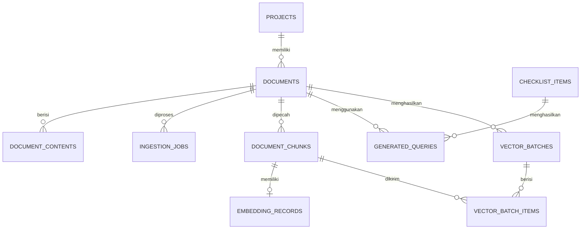
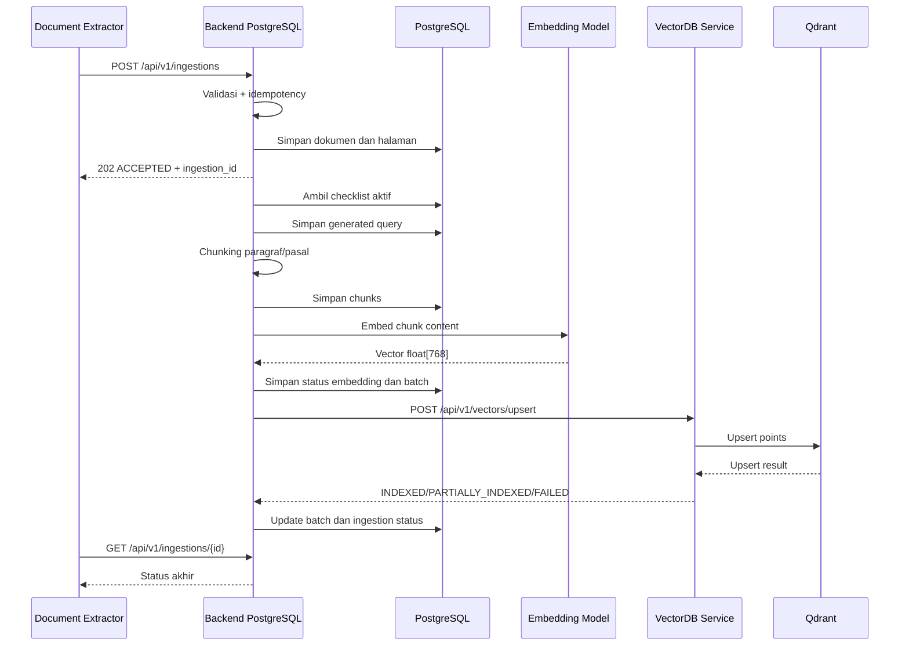

# AITF Team Integration Contract

> **Contract version:** `1.0`  
> **Tujuan:** menyamakan struktur data antara tim Document Extractor, Backend PostgreSQL, dan VectorDB.  
> **Catatan:** dokumen ini adalah kontrak integrasi yang harus disepakati tim. Endpoint di bawah belum seluruhnya tersedia pada implementasi repository saat ini.

---

## 1. Pembagian Tanggung Jawab

```text
┌───────────────────────────┐
│ Tim Document Extractor    │
│ File → JSON per halaman   │
└─────────────┬─────────────┘
              │ POST /api/v1/ingestions
              ▼
┌───────────────────────────┐
│ Tim Backend PostgreSQL    │
│                           │
│ • Validasi JSON           │
│ • Idempotensi             │
│ • Normalisasi             │
│ • Penyimpanan PostgreSQL  │
│ • Checklist dan query     │
│ • Chunking                │
│ • Embedding               │
│ • Vector batch            │
└─────────────┬─────────────┘
              │ POST /api/v1/vectors/upsert
              ▼
┌───────────────────────────┐
│ Tim VectorDB              │
│                           │
│ • Collection management   │
│ • Upsert ke Qdrant        │
│ • Search                  │
│ • Delete                  │
│ • Acknowledgment          │
└───────────────────────────┘
```

---

## 2. Kesepakatan Umum

| Item | Nilai |
|---|---|
| Schema version | `1.0` |
| ID format | UUID v4 |
| Waktu | ISO 8601 UTC, contoh `2026-10-01T08:30:00Z` |
| Content-Type | `application/json` |
| Bahasa utama | Indonesia (`id`) |
| Model embedding | `paraphrase-multilingual-mpnet-base-v2` |
| Vector dimension | `768` |
| Distance metric | `COSINE` |
| Collection TOR | `tor_chunks` |
| Collection referensi | `reference_chunks` |
| Source of truth | PostgreSQL |

### Document type

```text
TOR
RAB
SBM
ACUAN
KEPMEN
```

### Jalur dokumen

```text
RAB / SBM          → PostgreSQL + SQL/rule engine
TOR                → PostgreSQL + chunk + embedding → tor_chunks
ACUAN / KEPMEN     → PostgreSQL + chunk + embedding → reference_chunks
```

---

# A. Contract Document Extractor → Backend

## 3. Mengirim JSON Hasil Ekstraksi

### Request

```http
POST /api/v1/ingestions
Content-Type: application/json
```

```json
{
  "schema_version": "1.0",
  "request_id": "72a94104-e075-4e2f-a177-920f612e4655",
  "project_id": "fb3cf880-e53d-4fe6-a66c-e572b5b85db0",
  "document": {
    "document_id": "2d80aaac-86db-45e5-b894-8a46ccb45596",
    "document_type": "TOR",
    "file_name": "TOR_Pengadaan_2026.pdf",
    "mime_type": "application/pdf",
    "checksum_sha256": "f275c420337841011c9ef6ee7050cd1252dca660",
    "extracted_at": "2026-10-01T08:30:00Z"
  },
  "pages": [
    {
      "page_number": 1,
      "text": "Latar belakang kegiatan...",
      "metadata": {
        "language": "id",
        "ocr_used": false
      }
    },
    {
      "page_number": 2,
      "text": "Ruang lingkup kegiatan meliputi...",
      "metadata": {
        "language": "id",
        "ocr_used": false
      }
    }
  ],
  "tables": []
}
```

### Field wajib

| Field | Tipe | Aturan |
|---|---|---|
| `schema_version` | string | Harus `1.0` |
| `request_id` | UUID | Unik untuk satu request |
| `project_id` | UUID | Project harus sudah tersedia |
| `document.document_id` | UUID | Stabil untuk satu dokumen |
| `document.document_type` | enum | Salah satu document type |
| `document.file_name` | string | Nama file asli |
| `document.mime_type` | string | MIME file asli |
| `document.checksum_sha256` | string | SHA-256 file asli |
| `document.extracted_at` | datetime | ISO 8601 UTC |
| `pages` | array | Boleh kosong hanya untuk data tabel |
| `pages[].page_number` | integer | Mulai dari `1` |
| `pages[].text` | string | Teks halaman |

### Struktur tabel RAB

```json
{
  "tables": [
    {
      "page_number": 2,
      "table_index": 0,
      "columns": [
        "uraian",
        "volume",
        "satuan",
        "harga_satuan",
        "total"
      ],
      "rows": [
        {
          "uraian": "Tenaga Ahli",
          "volume": 2,
          "satuan": "orang",
          "harga_satuan": 15000000,
          "total": 30000000
        }
      ]
    }
  ]
}
```

### Success response

```http
202 Accepted
```

```json
{
  "schema_version": "1.0",
  "request_id": "72a94104-e075-4e2f-a177-920f612e4655",
  "ingestion_id": "6d613cd8-c2cc-460b-abfd-06b82f18dd71",
  "document_id": "2d80aaac-86db-45e5-b894-8a46ccb45596",
  "status": "ACCEPTED",
  "received_pages": 2,
  "received_tables": 0,
  "created_at": "2026-10-01T08:30:02Z"
}
```

---

## 4. Melihat Status Ingestion

### Request

```http
GET /api/v1/ingestions/{ingestion_id}
```

### Success response

```http
200 OK
```

```json
{
  "schema_version": "1.0",
  "ingestion_id": "6d613cd8-c2cc-460b-abfd-06b82f18dd71",
  "document_id": "2d80aaac-86db-45e5-b894-8a46ccb45596",
  "status": "READY_FOR_VECTOR_DB",
  "received_pages": 2,
  "generated_chunks": 8,
  "generated_vectors": 8,
  "error": null,
  "created_at": "2026-10-01T08:30:02Z",
  "completed_at": null
}
```

### Status ingestion

```text
ACCEPTED
VALIDATING
NORMALIZING
STORED
CHUNKING
EMBEDDING
READY_FOR_VECTOR_DB
INDEXING
INDEXED
PARTIALLY_INDEXED
FAILED
```

---

## 5. Melihat Dokumen

### Request

```http
GET /api/v1/documents/{document_id}
```

### Response

```json
{
  "document_id": "2d80aaac-86db-45e5-b894-8a46ccb45596",
  "project_id": "fb3cf880-e53d-4fe6-a66c-e572b5b85db0",
  "document_type": "TOR",
  "file_name": "TOR_Pengadaan_2026.pdf",
  "status": "READY_FOR_VECTOR_DB",
  "page_count": 2,
  "chunk_count": 8,
  "created_at": "2026-10-01T08:30:02Z",
  "updated_at": "2026-10-01T08:30:11Z"
}
```

---

# B. Struktur Internal Backend

## 6. Data yang Disimpan di PostgreSQL

| Tabel | Fungsi |
|---|---|
| `projects` | Menyimpan project dan klien |
| `documents` | Metadata utama dokumen |
| `document_contents` | Teks dan tabel per halaman |
| `ingestion_jobs` | Status pipeline ingestion |
| `checklist_items` | Kriteria pemeriksaan |
| `generated_queries` | Query yang dibuat dari checklist |
| `document_chunks` | Potongan TOR/acuan/Kepmen |
| `embedding_records` | Model, dimensi, dan status embedding |
| `vector_batches` | Status pengiriman batch ke VectorDB |
| `vector_batch_items` | Status setiap point dalam batch |

### ERD ringkas



---

## 7. Mengambil Checklist

### Request

```http
GET /api/v1/checklists?category=SUBSTANSI&document_type=TOR&active=true
```

### Response

```json
{
  "items": [
    {
      "checklist_item_id": "b31f495a-afba-4cd4-beb6-1522550c01d3",
      "item_key": "TOR_004",
      "checklist_number": 2,
      "category": "SUBSTANSI",
      "description": "TOR menjelaskan metodologi pelaksanaan",
      "is_active": true
    }
  ]
}
```

---

## 8. Membuat Query Checklist

### Request

```http
POST /api/v1/queries/generate
Content-Type: application/json
```

```json
{
  "document_id": "2d80aaac-86db-45e5-b894-8a46ccb45596",
  "checklist_item_ids": [
    "b31f495a-afba-4cd4-beb6-1522550c01d3"
  ]
}
```

### Response

```json
{
  "document_id": "2d80aaac-86db-45e5-b894-8a46ccb45596",
  "queries": [
    {
      "query_id": "2e490584-151c-4242-9a1c-1d94831e185a",
      "checklist_item_id": "b31f495a-afba-4cd4-beb6-1522550c01d3",
      "query_text": "metodologi metode pelaksanaan pendekatan teknis tahapan pekerjaan",
      "filters": {
        "project_id": "fb3cf880-e53d-4fe6-a66c-e572b5b85db0",
        "document_type": "TOR",
        "is_active": true
      },
      "top_k": 5
    }
  ]
}
```

---

## 9. Melihat Chunk Dokumen

### Request

```http
GET /api/v1/documents/{document_id}/chunks
```

### Response

```json
{
  "document_id": "2d80aaac-86db-45e5-b894-8a46ccb45596",
  "items": [
    {
      "chunk_id": "769a14d8-5ec6-4fd6-810b-801012d9270a",
      "chunk_index": 0,
      "chunk_type": "PARAGRAF",
      "content": "Ruang lingkup kegiatan meliputi...",
      "page_number": 2,
      "pasal_number": null,
      "metadata": {
        "section_title": "Ruang Lingkup"
      }
    }
  ]
}
```

---

# C. Contract Backend → VectorDB

## 10. Collection Qdrant

### `tor_chunks`

- Berisi chunk dokumen TOR.
- Semua search wajib difilter menggunakan `project_id`.
- Revisi lama memiliki `is_active: false`.

### `reference_chunks`

- Berisi chunk ACUAN dan KEPMEN.
- Menyimpan nomor pasal dan edisi.
- Dapat digunakan lintas project jika aturan bisnis mengizinkan.

### Konfigurasi

```yaml
vector_size: 768
distance: COSINE
```

---

## 11. Upsert Vector Batch

Endpoint ini disediakan oleh tim VectorDB.

### Request

```http
POST /api/v1/vectors/upsert
Content-Type: application/json
```

```json
{
  "schema_version": "1.0",
  "batch_id": "3773d072-b226-4048-a50d-a68413b64f37",
  "collection": "tor_chunks",
  "embedding": {
    "model": "paraphrase-multilingual-mpnet-base-v2",
    "dimension": 768,
    "distance": "COSINE"
  },
  "points": [
    {
      "id": "f06bed98-003a-4a15-a033-094be9230366",
      "vector": [0.014, -0.028, 0.091],
      "payload": {
        "schema_version": "1.0",
        "project_id": "fb3cf880-e53d-4fe6-a66c-e572b5b85db0",
        "document_id": "2d80aaac-86db-45e5-b894-8a46ccb45596",
        "document_type": "TOR",
        "chunk_id": "769a14d8-5ec6-4fd6-810b-801012d9270a",
        "chunk_index": 0,
        "chunk_type": "PARAGRAF",
        "content": "Ruang lingkup kegiatan meliputi...",
        "page_number": 2,
        "pasal_number": null,
        "file_name": "TOR_Pengadaan_2026.pdf",
        "edition": null,
        "is_active": true
      }
    }
  ]
}
```

> Contoh vector dipersingkat. Request aktual wajib memiliki tepat 768 nilai.

### Success response

```http
202 Accepted
```

```json
{
  "schema_version": "1.0",
  "batch_id": "3773d072-b226-4048-a50d-a68413b64f37",
  "status": "INDEXED",
  "collection": "tor_chunks",
  "indexed_count": 1,
  "failed_count": 0,
  "failed_points": [],
  "indexed_at": "2026-10-01T08:31:00Z"
}
```

### Partial response

```json
{
  "schema_version": "1.0",
  "batch_id": "3773d072-b226-4048-a50d-a68413b64f37",
  "status": "PARTIALLY_INDEXED",
  "collection": "tor_chunks",
  "indexed_count": 7,
  "failed_count": 1,
  "failed_points": [
    {
      "point_id": "f06bed98-003a-4a15-a033-094be9230366",
      "reason": "VECTOR_DIMENSION_MISMATCH"
    }
  ],
  "indexed_at": "2026-10-01T08:31:00Z"
}
```

---

## 12. Search Vector

Endpoint ini disediakan oleh tim VectorDB.

### Request

```http
POST /api/v1/vectors/search
Content-Type: application/json
```

```json
{
  "schema_version": "1.0",
  "collection": "tor_chunks",
  "query_id": "2e490584-151c-4242-9a1c-1d94831e185a",
  "query_vector": [0.082, -0.013, 0.041],
  "limit": 5,
  "score_threshold": 0.6,
  "filters": {
    "project_id": "fb3cf880-e53d-4fe6-a66c-e572b5b85db0",
    "document_id": "2d80aaac-86db-45e5-b894-8a46ccb45596",
    "is_active": true
  }
}
```

> `query_vector` aktual wajib memiliki 768 nilai.

### Response

```json
{
  "schema_version": "1.0",
  "query_id": "2e490584-151c-4242-9a1c-1d94831e185a",
  "collection": "tor_chunks",
  "results": [
    {
      "id": "f06bed98-003a-4a15-a033-094be9230366",
      "score": 0.87,
      "payload": {
        "project_id": "fb3cf880-e53d-4fe6-a66c-e572b5b85db0",
        "document_id": "2d80aaac-86db-45e5-b894-8a46ccb45596",
        "document_type": "TOR",
        "chunk_id": "769a14d8-5ec6-4fd6-810b-801012d9270a",
        "chunk_index": 0,
        "content": "Ruang lingkup kegiatan meliputi...",
        "page_number": 2,
        "is_active": true
      }
    }
  ]
}
```

### Aturan search

- `project_id` wajib untuk collection `tor_chunks`.
- `is_active: true` wajib untuk pencarian normal.
- `document_id` opsional jika search dilakukan ke semua TOR dalam project.
- `limit` default `5`, maksimum disepakati `20`.
- Hasil diurutkan dari score tertinggi.

---

## 13. Menghapus Vector Dokumen

Endpoint ini disediakan oleh tim VectorDB.

### Request

```http
DELETE /api/v1/vectors/documents/{document_id}?collection=tor_chunks
```

### Response

```json
{
  "schema_version": "1.0",
  "document_id": "2d80aaac-86db-45e5-b894-8a46ccb45596",
  "collection": "tor_chunks",
  "status": "DELETED",
  "deleted_points": 8
}
```

---

## 14. Menonaktifkan Versi Lama

Jika dokumen direvisi, data lama tidak langsung dihapus untuk menjaga audit trail.

```text
Versi lama → is_active = false
Versi baru → is_active = true
```

Endpoint opsional milik VectorDB:

```http
PATCH /api/v1/vectors/documents/{document_id}/deactivate
```

Response:

```json
{
  "document_id": "2d80aaac-86db-45e5-b894-8a46ccb45596",
  "status": "DEACTIVATED",
  "updated_points": 8
}
```

---

## 15. VectorDB Health Check

### Request

```http
GET /health
```

### Response

```json
{
  "status": "ok",
  "qdrant": "ok",
  "collections": {
    "tor_chunks": "ready",
    "reference_chunks": "ready"
  }
}
```

---

# D. Error Contract

## 16. Format Error Standar

```json
{
  "error": {
    "code": "INVALID_INGESTION_PAYLOAD",
    "message": "Payload hasil ekstraksi tidak valid",
    "details": [
      {
        "field": "pages[0].page_number",
        "reason": "must be greater than zero"
      }
    ],
    "request_id": "72a94104-e075-4e2f-a177-920f612e4655"
  }
}
```

### Error code minimum

| HTTP | Code | Arti |
|---:|---|---|
| 400 | `INVALID_REQUEST` | Request tidak dapat diproses |
| 404 | `PROJECT_NOT_FOUND` | Project tidak tersedia |
| 404 | `DOCUMENT_NOT_FOUND` | Dokumen tidak tersedia |
| 409 | `IDEMPOTENCY_CONFLICT` | Request ID digunakan untuk payload berbeda |
| 409 | `DOCUMENT_VERSION_CONFLICT` | Konflik versi dokumen |
| 422 | `INVALID_INGESTION_PAYLOAD` | JSON extractor tidak valid |
| 422 | `VECTOR_DIMENSION_MISMATCH` | Vector bukan 768 dimensi |
| 422 | `INVALID_VECTOR_PAYLOAD` | Payload point tidak lengkap |
| 503 | `VECTOR_DB_UNAVAILABLE` | Qdrant tidak tersedia |
| 500 | `EMBEDDING_FAILED` | Embedding gagal |

---

# E. Urutan Integrasi

## 17. Sequence Diagram



---

## 18. Checklist Kesepakatan Tim

### Tim Extractor

- [ ] Menghasilkan satu JSON untuk satu dokumen.
- [ ] Mengirim teks per halaman.
- [ ] Mengirim tabel RAB secara terstruktur.
- [ ] Menghasilkan UUID dan SHA-256.
- [ ] Menandai penggunaan OCR.
- [ ] Mengikuti contract `1.0`.

### Tim Backend

- [ ] Memvalidasi contract input.
- [ ] Menangani request duplikat dengan aman.
- [ ] Menyimpan sumber data di PostgreSQL.
- [ ] Menyimpan checklist dan generated query.
- [ ] Membuat chunk per paragraf/pasal.
- [ ] Menghasilkan vector berdimensi 768.
- [ ] Mengirim batch sesuai contract VectorDB.
- [ ] Menyimpan acknowledgment.

### Tim VectorDB

- [ ] Menyediakan `tor_chunks` dan `reference_chunks`.
- [ ] Menggunakan dimension `768` dan cosine distance.
- [ ] Memvalidasi point dan payload.
- [ ] Menyediakan endpoint upsert, search, delete, dan health.
- [ ] Memfilter `project_id` pada pencarian TOR.
- [ ] Memfilter `is_active: true` pada pencarian normal.
- [ ] Mengembalikan acknowledgment per batch.

---

## 19. Definition of Done Integrasi

Integrasi dianggap selesai ketika:

1. Extractor mengirim JSON sesuai contract.
2. Backend menerima dan menyimpan data tanpa perubahan ID.
3. Chunk dapat ditelusuri ke halaman sumber.
4. Setiap embedding tepat 768 dimensi.
5. VectorDB berhasil menyimpan seluruh point.
6. Search dengan `project_id` tidak mengembalikan data project lain.
7. Search hanya mengembalikan `is_active: true`.
8. Delete dokumen menghapus seluruh point terkait.
9. Retry request tidak menghasilkan duplikasi.
10. PostgreSQL mencatat status akhir `INDEXED`.
